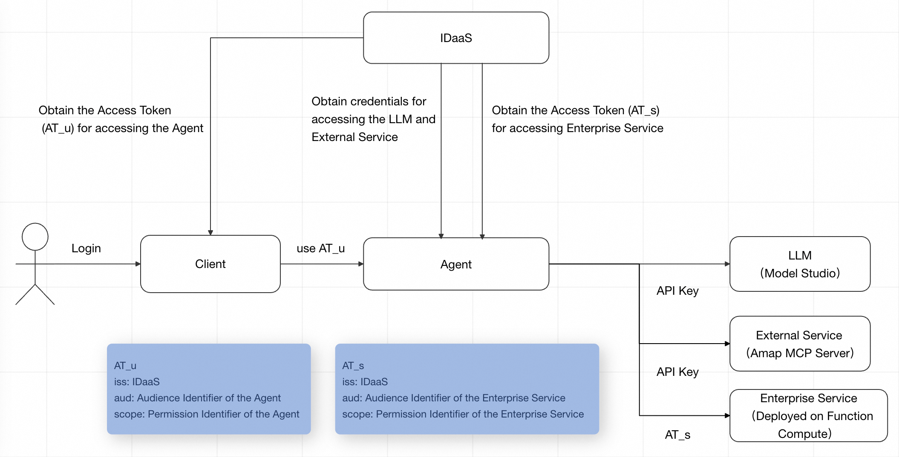
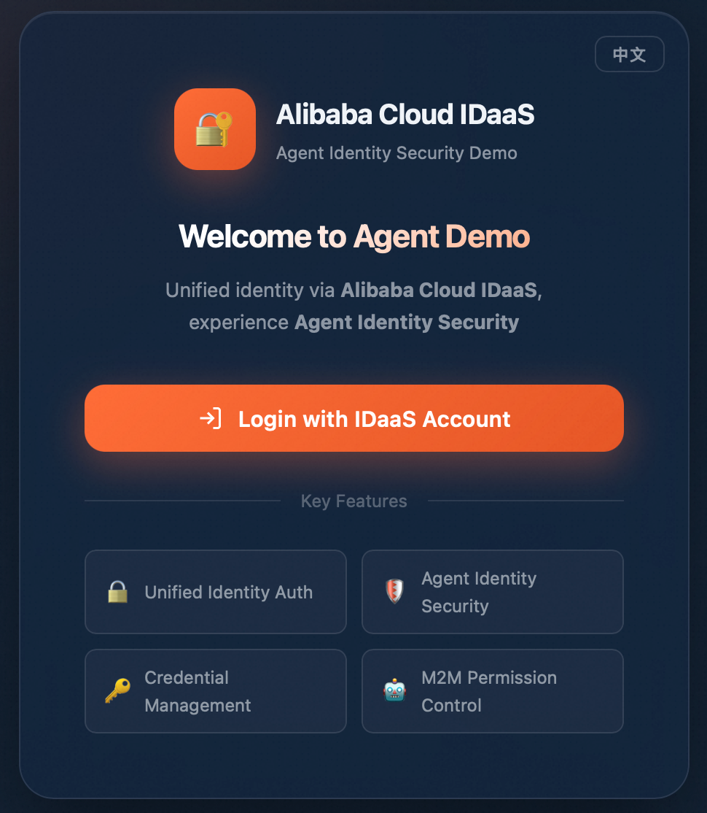
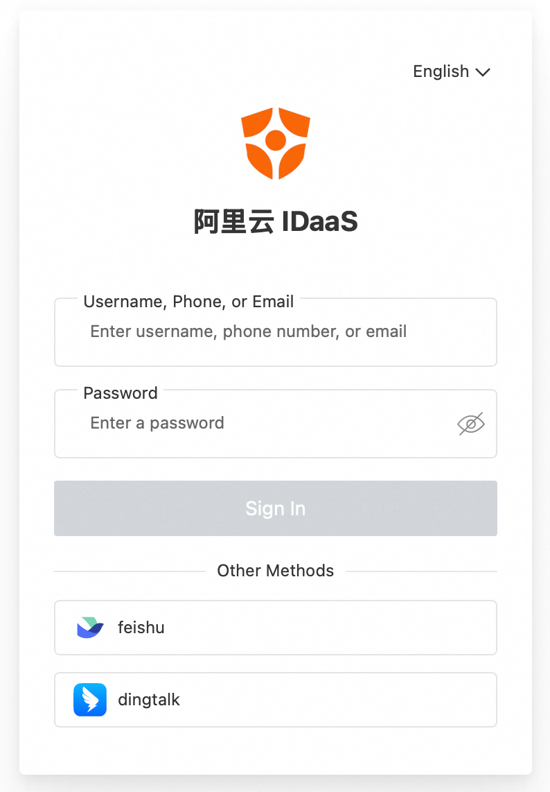

# Agent Identity Security Sample

[简体中文](README_zh.md)

Agent Identity Security is an identity and access management framework designed by Alibaba Cloud IDaaS for AI Agents. It securely manages the digital identity of Agents, protects their access credentials (API Keys, OAuth Tokens, etc.), and enables Agents to securely access large language models, external service, and enterprise systems — either using their own identity or acting on behalf of a user.

This sample is built on **Alibaba Cloud Model Studio**, **Amap MCP Server**, and **Function Compute**, demonstrating how to implement Agent-centric inbound and outbound identity access control through IDaaS.

## How It Works



### Inbound Access

1. **User Authentication**: The user completes SSO login through the client application and obtains an Access Token (**AT_u**) with permission to access the Agent service. AT_u carries the following key claims:

   - `iss`: The Issuer of the IDaaS EIAM instance
   - `aud`: The audience identifier of the Agent
   - `scope`: The permission identifier of the Agent

2. **Invoke Agent**: The client sends **AT_u** as a Bearer Token in the request header, along with the user's AI request, to the Agent service.

3. **Authorization Verification**: The Agent service validates **AT_u** for signature, audience, and scope. Upon successful verification, the Agent initialization flow begins.

### Agent Initialization & Outbound Access

After verification, the Agent can obtain downstream credentials and initialize in two different modes:

#### Machine Identity (Machine)

The Agent retrieves all downstream credentials from IDaaS using its own M2M client application identity.

| Step                                | Description                                                                                                                                                                                                                                                                                                                |
|-------------------------------------|----------------------------------------------------------------------------------------------------------------------------------------------------------------------------------------------------------------------------------------------------------------------------------------------------------------------------|
| Obtain Large Language Model API Key                     | The Agent retrieves the hosted Model Studio API Key from IDaaS using its M2M client identity to initialize the Agent's Model                                                                                                                                                                                               |
| Obtain External Service API Key     | The Agent retrieves the hosted Amap MCP Server API Key from IDaaS using its M2M client identity to construct the MCP Tool                                                                                                                                                                                                  |
| Obtain Enterprise Service Access Token | The Agent retrieves an Access Token (**AT_s**) from IDaaS using its M2M client identity to construct the Enterprise Service Tool. AT_s carries: <br> *`iss` (Issuer of the IDaaS EIAM instance), <br> *`aud` (audience identifier of the enterprise service), <br> *`scope` (permission identifier of the enterprise service) |
| Agent Initialization                | After the above steps, the Agent is fully capable of calling the Large Language Model, external service, and enterprise service                                                                                                                                                                                                                |

This mode is suitable for scenarios where the Agent operates independently using its own identity. Downstream services perceive the Agent's machine identity.

#### User Identity (Human)

The Agent exchanges the user's AT_u for downstream service credentials via Token Exchange.

| Step | Description                                                                                                                                                                                                                                                                                                                                       |
| --- |---------------------------------------------------------------------------------------------------------------------------------------------------------------------------------------------------------------------------------------------------------------------------------------------------------------------------------------------------|
| Obtain Large Language Model API Key | The Agent exchanges AT_u for a credential to access IDaaS with user identity, then retrieves the hosted Model Studio API Key to initialize the Agent's Model                                                                                                                                                                                      |
| Obtain External Service API Key        | The Agent exchanges AT_u for a credential to access IDaaS with user identity, then retrieves the hosted Amap MCP Server API Key to construct the MCP Tool                                                                                                                                                                                         |
| Obtain Enterprise Service Access Token | The Agent exchanges AT_u for an Access Token (**AT_s**) to access the enterprise service with user identity to construct the Enterprise Service Tool. AT_s carries: <br> *`iss` (Issuer of the IDaaS EIAM instance), <br> *`aud` (audience identifier of the enterprise service), <br> *`scope` (permission identifier of the enterprise service) |
| Agent Initialization                   | After the above steps, the Agent is fully capable of calling the Large Language Model, external service, and enterprise service                                                                                                                                                                                                                                    |

This mode is suitable for scenarios that require user identity awareness. The user identity propagates through the complete call chain from the Agent to downstream services.

### AI Request Processing

Once initialization is complete, the Agent receives the user's AI request. The Large Language Model autonomously decides which Tool to call — the Large Language Model, external MCP service, or enterprise service Tool — and returns the result to the user.

## Prerequisites

1. **Prepare the Runtime Environment**

   1. JDK 17+: [Install JDK](https://www.oracle.com/java/technologies/javase-downloads.html)
   2. Maven: [Install Maven](https://maven.apache.org/download.cgi)

2. **Prepare IDaaS Capabilities**

   1. Log in to the IDaaS management console and switch to the target region. In the left navigation pane, select **EIAM**.
   2. Click **Create Instance** to create an IDaaS instance.
   3. Click **Upgrade** in the **Actions** column and enable M2M Management on the purchase page.
   4. Click **Console** in the **Actions** column, then go to **Account > Accounts and Orgs> Create Account** in the left menu to create an IDaaS account.

3. **Create a Model Studio API Key**: See [Get API Key](https://help.aliyun.com/zh/model-studio/get-api-key) to create a Model Studio API Key with model invocation permissions.

4. **Activate Function Compute**: See [Activate Function Compute](https://help.aliyun.com/zh/functioncompute/fc/web-function-quick-start).

5. **Complete IDaaS Agent Inbound/Outbound Configuration**: See [Agent Identity Security Configuration Guide](https://help.aliyun.com/zh/idaas/eiam/user-guide/agent-id-configuration-guide). Key configuration points:

   1. **Large Language Model Node**: Add the Model Studio API Key. This sample requires the Model Studio API Key.
   2. **External Service Node**: Add the external service API Key. This sample requires the Amap MCP Server API Key.
   3. **Enterprise Service Node**: Add the enterprise service M2M application and configure the audience identifier and permission identifier.

## Agent Service Deployment

### IDaaS SDK Configuration

This sample uses the IDaaS SDK, which reads IDaaS configuration from config files.

1. Go to the IDaaS instance console, click **Agent ID Gard** in the left menu, and select the Agent.
2. In the canvas, click **Agent > General> Authentication Management**. You can generate the SDK configuration using Client Secret or a public/private key credential. Click **Generate SDK Configuration** and copy the content.
3. Paste the copied configuration into the following two files:
   - `src/main/resources/cloud_idaas_config_for_computer.json` (for local deployment)
   - `src/main/resources/cloud_idaas_config_for_agent_run.json` (for AgentRun deployment)

For detailed configuration instructions, see: [Environment Preparation](https://help.aliyun.com/zh/idaas/eiam/developer-reference/environmental-preparation).

### Deploy Enterprise Service on Function Compute

#### Create a Function

1. Log in to the Function Compute console, and click **Function Management > Functions > Create Function** in the left navigation pane.
2. Click **Create Web Function**, and select **Custom Runtime > Java > Java 17** as the runtime.
3. Select **Use Sample Code** as the code upload method, and keep other settings as default.
4. Click **Create** to complete the function creation.

#### Configure IDaaS JWT Authentication

Configure JWT authentication for the HTTP trigger of the function to ensure only requests carrying an IDaaS-issued Access Token can access the enterprise service:

1. Go to the IDaaS instance console, click **Application Management > M2M Application** in the left navigation pane, and select the enterprise service application created in the outbound configuration.
2. Copy the JWKS endpoint from **General > Application Settings**, open it in a browser, and copy all the content.
3. Go to the Function Compute console, click **Function Management > Functions** in the left navigation pane, and select the function created in the previous step.
4. In the function details, click the **Trigger** in the **Function Topology**, select **JWT Authentication** as the authentication method, and paste the copied content into the **JWKS** field.
5. Set the **Parameter Name** in the JWT Token configuration to **Authorization** and click **OK**.

### Code Examples

**OpenAI-Compatible API Endpoint**

```java
@PostMapping("/openai/v1/chat/completions")
public SseEmitter chatCompletions(@RequestHeader(value = "Authorization", required = true) String accessToken,
                                   @RequestBody ChatCompletionRequest request) throws Exception {

    // Remove "Bearer " prefix to extract the Access Token
    accessToken = accessToken.substring(7);

    // Validate AT_u: signature verification, audience verification, and scope verification
    // Signature verification uses the IDaaS instance's JWKS endpoint, specified via environment variable
    String jwksEndpoint = System.getenv("JWKS_ENDPOINT");
    if (jwksEndpoint == null) {
        throw new ConfigException("JWKS_ENDPOINT should be specified via an environment variable.");
    }
    JwtValidator.validate(jwksEndpoint, accessToken);

    // Initialize Agent
    // The Agent identity mode must be specified via environment variable: Machine or Human
    ReActAgent agent;
    String accessIdentity = System.getenv("ACCESS_IDENTITY");
    if ("Machine".equals(accessIdentity)) {
        agent = AgentUtils.createAgentByMachineIdentity();
    } else if ("Human".equals(accessIdentity)) {
        agent = AgentUtils.createAgentByHumanIdentity(accessToken);
    } else {
        throw new ConfigException("ACCESS_IDENTITY should be either Machine or Human.");
    }

    // Start conversation with the Agent
    return ChatUtils.startChat(agent, request);
}
```

**AgentUtils - Machine Identity Mode**: Retrieves all credentials from IDaaS using M2M client identity and initializes the Agent:

```java
public static ReActAgent createAgentByMachineIdentity() {

    // Read SDK configuration file and complete IDaaS configuration initialization
    // To use IDaaS SDK to retrieve credentials hosted in IDaaS, this initialization method must be completed first
    IDaaSCredentialProviderFactory.init();

    // Create IDaaS SDK client to retrieve hosted credentials as M2M client identity
    IDaaSPamClient client = IDaaSPamClient.builder().build();

    // Example: Create Agent Model based on Model Studio platform
    // Retrieve hosted Large Language Model API Key here to initialize the Agent's Model
    // API Key ID needs to be specified via environment variable
    String llmApiKeyIdentifier = System.getenv("LLM_API_KEY_IDENTIFIER");
    if (llmApiKeyIdentifier == null){
        throw new ConfigException("LLM_API_KEY_IDENTIFIER should be specified via an environment variable.");
    }
    String llmApiKey = client.getApiKey(llmApiKeyIdentifier);

    // Initialize Model Studio qwen-plus Model
    DashScopeChatModel model = DashScopeChatModel.builder()
            .apiKey(llmApiKey)
            .modelName("qwen-plus")
            .stream(true)
            .enableThinking(true)
            .formatter(new DashScopeChatFormatter())
            .defaultOptions(GenerateOptions.builder()
                    .thinkingBudget(5000)
                    .build())
            .build();

    Toolkit toolkit = new Toolkit();

    // Example: Use Amap MCP Server on Model Studio platform as external service
    // Retrieve hosted external service API Key here to construct Tool for accessing external service
    // API Key ID needs to be specified via environment variable
    String externalServerApiKeyIdentifier = System.getenv("EXTERNAL_SERVER_API_KEY_IDENTIFIER");
    if (externalServerApiKeyIdentifier == null){
        throw new ConfigException("EXTERNAL_SERVER_API_KEY_IDENTIFIER should be specified via an environment variable.");
    }
    String externalServerApiKey = client.getApiKey(externalServerApiKeyIdentifier);

    // Amap MCP Server SSE Endpoint needs to be specified via environment variable
    String externalServerUrl = System.getenv("EXTERNAL_SERVER_URL");
    if (externalServerUrl == null){
        throw new ConfigException("EXTERNAL_SERVER_URL should be specified via an environment variable.");
    }
    // Construct Tool for accessing Amap MCP Server
    McpClientWrapper externalServerClient = McpClientBuilder.create("Amap-Maps")
            .streamableHttpTransport(externalServerUrl)
            .header("Authorization", "Bearer " + externalServerApiKey)
            .timeout(Duration.ofSeconds(60))
            .buildAsync()
            .block();

    toolkit.registerMcpClient(externalServerClient).block();

    // Example: Deploy enterprise service based on Function Compute
    // When Agent accesses enterprise service, AccessToken is required, and scope needs to be specified via environment variable
    // Scope format is audience identifier + "|" + permission identifier, corresponding to enterprise service application's audience and permission identifiers
    String enterpriseServiceScope = System.getenv("ENTERPRISE_SERVICE_SCOPE");
    if (enterpriseServiceScope == null){
        throw new ConfigException("ENTERPRISE_SERVICE_SCOPE should be specified via an environment variable.");
    }
    // Retrieve IDaaS credential provider for obtaining credentials to access enterprise service
    IDaaSCredentialProvider credentialProvider = IDaaSCredentialProviderFactory.getIDaaSCredentialProvider(enterpriseServiceScope);
    String AT_s = credentialProvider.getBearerToken();

    // Register custom Tool for accessing enterprise service
    toolkit.registration()
            .tool(new EnterpriseServiceSampleTool())
            .presetParameters(Map.of("enterprise_service_sample", Map.of("AccessToken", AT_s)))
            .apply();

    // Initialize Agent with configured Model Studio Model, Amap MCP Server Tool, and enterprise service Tool
    return ReActAgent.builder()
            .name("Assistant")
            .sysPrompt("You are a helpful AI assistant. Be friendly and concise, and think and reply in english.")
            .model(model)
            .memory(new InMemoryMemory())
            .toolkit(toolkit)
            .build();
}
```

**AgentUtils - Human Identity Mode**: Exchanges AT_u for user identity credentials via Token Exchange, then retrieves credentials with user identity and initializes the Agent:

```java
public static ReActAgent createAgentByHumanIdentity(String accessToken) {

    // Read SDK configuration file and complete IDaaS configuration initialization
    // To use IDaaS SDK to retrieve credentials hosted in IDaaS, this initialization method must be completed first
    IDaaSCredentialProviderFactory.init();

    // Retrieve IDaaS Token Exchange credential provider for exchanging credentials to access IDaaS with user identity
    IDaaSTokenExchangeCredentialProvider defaultTokenExchangeProvider = IDaaSCredentialProviderFactory.getIDaaSTokenExchangeCredentialProvider();
    // Exchange AT_u for credentials to access IDaaS with user identity
    IDaaSCredential credential = defaultTokenExchangeProvider.getCredential(accessToken, OAuth2Constants.ACCESS_TOKEN_TYPE, OAuth2Constants.ACCESS_TOKEN_TYPE);

    // Build static credential provider with user identity credentials
    IDaaSCredentialProvider staticCredentialProvider = StaticIDaaSCredentialProvider.builder()
            .setCredential(credential)
            .build();
    // Create IDaaS SDK client to retrieve hosted credentials with user identity
    IDaaSPamClient client = IDaaSPamClient.builder()
            .credentialProvider(staticCredentialProvider)
            .build();

    // Example: Create Agent Model based on Model Studio platform
    // Retrieve hosted Large Language Model API Key here to initialize the Agent's Model
    // API Key ID needs to be specified via environment variable
    String llmApiKeyIdentifier = System.getenv("LLM_API_KEY_IDENTIFIER");
    if (llmApiKeyIdentifier == null){
        throw new ConfigException("LLM_API_KEY_IDENTIFIER should be specified via an environment variable.");
    }
    String llmApiKey = client.getApiKey(llmApiKeyIdentifier);

    // Initialize Model Studio qwen-plus Model
    DashScopeChatModel model = DashScopeChatModel.builder()
            .apiKey(llmApiKey)
            .modelName("qwen-plus")
            .stream(true)
            .enableThinking(true)
            .formatter(new DashScopeChatFormatter())
            .defaultOptions(GenerateOptions.builder()
                    .thinkingBudget(5000)
                    .build())
            .build();

    Toolkit toolkit = new Toolkit();

    // Example: Use Amap MCP Server on Model Studio platform as external service
    // Retrieve hosted external service API Key here to construct Tool for accessing external service
    // API Key ID needs to be specified via environment variable
    String externalServerApiKeyIdentifier = System.getenv("EXTERNAL_SERVER_API_KEY_IDENTIFIER");
    if (externalServerApiKeyIdentifier == null){
        throw new ConfigException("EXTERNAL_SERVER_API_KEY_IDENTIFIER should be specified via an environment variable.");
    }
    String externalServerApiKey = client.getApiKey(externalServerApiKeyIdentifier);

    // Amap MCP Server SSE Endpoint needs to be specified via environment variable
    String externalServerUrl = System.getenv("EXTERNAL_SERVER_URL");
    if (externalServerUrl == null){
        throw new ConfigException("EXTERNAL_SERVER_URL should be specified via an environment variable.");
    }
    // Construct Tool for accessing Amap MCP Server
    McpClientWrapper externalServerClient = McpClientBuilder.create("Amap-Maps")
            .streamableHttpTransport(externalServerUrl)
            .header("Authorization", "Bearer " + externalServerApiKey)
            .timeout(Duration.ofSeconds(60))
            .buildAsync()
            .block();

    toolkit.registerMcpClient(externalServerClient).block();

    // Example: Deploy enterprise service based on Function Compute
    // When Agent accesses enterprise service, AccessToken is required, and scope needs to be specified via environment variable
    // Scope format is audience identifier + "|" + permission identifier, corresponding to enterprise service application's audience and permission identifiers
    String enterpriseServiceScope = System.getenv("ENTERPRISE_SERVICE_SCOPE");
    if (enterpriseServiceScope == null){
        throw new ConfigException("ENTERPRISE_SERVICE_SCOPE should be specified via an environment variable.");
    }

    // Retrieve IDaaS Token Exchange credential provider for exchanging credentials to access enterprise service with user identity
    IDaaSTokenExchangeCredentialProvider enterpriseServiceTokenExchangeProvider = IDaaSCredentialProviderFactory.getIDaaSTokenExchangeCredentialProvider(enterpriseServiceScope);
    // Exchange AT_u for credentials to access enterprise service with user identity
    String AT_s = enterpriseServiceTokenExchangeProvider.getIssuedToken(accessToken, OAuth2Constants.ACCESS_TOKEN_TYPE, OAuth2Constants.ACCESS_TOKEN_TYPE);

    // Register custom Tool for accessing enterprise service
    toolkit.registration()
            .tool(new EnterpriseServiceSampleTool())
            .presetParameters(Map.of("enterprise_service_sample", Map.of("AccessToken", AT_s)))
            .apply();

    // Initialize Agent with configured Model Studio Model, Amap MCP Server Tool, and enterprise service Tool
    return ReActAgent.builder()
            .name("Assistant")
            .sysPrompt("You are a helpful AI assistant. Be friendly and concise, and think and reply in english.")
            .model(model)
            .memory(new InMemoryMemory())
            .toolkit(toolkit)
            .build();
}
```

**Enterprise Service Tool**: Sends an HTTP request to the enterprise service deployed on Function Compute, carrying AT_s:

```java
@Tool(name = "enterprise_service_sample", description = "A simple example of enterprise service deployed on Function Compute")
public String enterpriseServiceSample(
        @ToolParam(name = "AccessToken", description = "Access Token for accessing the enterprise service.") String accessToken) {
    Map<String, List<String>> headers = new HashMap<>();
    headers.put("Authorization", Collections.singletonList("Bearer " + accessToken));
    // The public access address of Function Compute, specified via environment variable
    String enterpriseServiceUrl = System.getenv("ENTERPRISE_SERVICE_URL");
    HttpRequest request = new HttpRequest.Builder()
            .httpMethod(HttpMethod.POST)
            .url(enterpriseServiceUrl)
            .headers(headers)
            .build();
    HttpResponse response = HttpClientFactory.getDefaultHttpClient().send(request);
    return response.getBody();
}
```

### Local Deployment

#### Configure Environment Variables

```bash
export IDAAS_CLIENT_SECRET=xxx     # Required for Client Secret authentication
export ENV_PRIVATE_KEY=xxx         # Required for public/private key authentication
export JWKS_ENDPOINT=https://xxx.aliyunidaas.com/api/v2/iauths_system/oauth2/jwks
export AGENT_AUDIENCE=https://agentserver.example.com
export AGENT_SCOPE=agent.access
export ACCESS_IDENTITY=Machine     # Machine or Human
export LLM_API_KEY_IDENTIFIER=llm_api_key
export EXTERNAL_SERVER_API_KEY_IDENTIFIER=mcp_server_api_key
export ENTERPRISE_SERVICE_SCOPE="https://mcpserver.com|mcp.access"
export EXTERNAL_SERVER_URL=https://dashscope.aliyuncs.com/api/v1/mcps/amap-maps/mcp
export ENTERPRISE_SERVICE_URL=https://xxx.fcapp.run
```
| Environment Variable | Description | How to Obtain                                                                                                                                                                                                                                                                                                              |
| --- | --- |----------------------------------------------------------------------------------------------------------------------------------------------------------------------------------------------------------------------------------------------------------------------------------------------------------------------------|
| IDAAS\_CLIENT\_SECRET | Agent's Client Secret (required for Client Secret authentication) | 1. Go to the IDaaS instance page, click **Agent ID Gard** in the left navigation pane, and select the Agent.<br>    2. In the canvas, click **Agent > General**, and copy the Client Secret credential from **Authentication Management**.                                                                                 |
| ENV\_PRIVATE\_KEY | Agent's private key (required for public/private key authentication; corresponds to the uploaded public key's private key) | Keep it when creating the public/private key credential.                                                                                                                                                                                                                                                                   |
| JWKS\_ENDPOINT | IDaaS JWKS endpoint for verifying AT\_u signature | 1. Go to the IDaaS instance page, click **Application Management > M2M Application** in the left navigation pane, and select the client application.<br>    2. Copy the JWKS endpoint from **General > Application Settings**.                                                                                             |
| AGENT\_AUDIENCE | Agent's audience identifier for verifying the `aud` field of AT\_u | 1. Go to the IDaaS instance page, click **Agent ID Gard** in the left navigation pane, and select the Agent.<br>    2. In the canvas, click **Agent > General**, and copy from **ResourceServer Identifier**.                                                                                                              |
| AGENT\_SCOPE | Agent's permission identifier for verifying the `scope` field of AT\_u | 1. Go to the IDaaS instance page, click **Agent ID Gard** in the left navigation pane, and select the Agent.<br>    2. In the canvas, click **Agent > Permission Configuration**, and copy the permission identifier.                                                                                                      |
| ACCESS\_IDENTITY | Agent identity mode: `Machine` or `Human` | Configure based on business requirements.                                                                                                                                                                                                                                                                                  |
| LLM\_API\_KEY\_IDENTIFIER | API Key ID for the Large Language Model node. | 1. Go to the IDaaS instance page, click **Agent ID Gard** in the left navigation pane, and select the Agent.<br>    2. In the canvas, click **Large Language Model > Basic Information** and copy the API Key ID.                                                                                                          |
| EXTERNAL\_SERVER\_API\_KEY\_IDENTIFIER | API Key ID for the external service node. | 1. Go to the IDaaS instance page, click **Agent ID Gard** in the left navigation pane, and select the Agent.<br>    2. In the canvas, click **External Service > Basic Information** and copy the API Key ID.                                                                                                              |
| ENTERPRISE\_SERVICE\_SCOPE | Access scope for the enterprise service, format: `audience\|permission` | 1. Go to the IDaaS instance page, click **Agent ID Gard** in the left navigation pane, and select the Agent.<br>    2. In the canvas, click **Enterprise Service > General > Authentication Management** and copy the audience identifier.<br>    3. Click **Permission Configuration** and copy the permission identifier. |
| EXTERNAL\_SERVER\_URL | Endpoint for the external service (Amap MCP Server SSE Endpoint). | Fixed as `https://dashscope.aliyuncs.com/api/v1/mcps/amap-maps/mcp`                     |
| ENTERPRISE\_SERVICE\_URL | Endpoint for the enterprise service (Function Compute public access address). | 1. Go to the Function Compute console, click **Function Management > Functions** in the left navigation pane, and select the previously created function.<br>    2. In the function details, click the **Trigger** in the **Function Topology** and copy the public access address.                                        |

#### Run the Sample

1. Run the following command in the sample directory to package the project into a JAR:

   ```bash
   mvn clean package
   ```

2. Run the JAR. The sample specifies the IDaaS SDK config file via a Java system property. For more information, see: [Environment Preparation](https://help.aliyun.com/zh/idaas/eiam/developer-reference/environmental-preparation).

   ```bash
   java -Dcloud_idaas_config_path=alibaba_cloud_idaas_config_for_computer.json -jar target/idaas-java-agent-id-demo-1.0.jar
   ```

### AgentRun Platform Deployment

#### Package and Archive the Project

1. Run the following command in the sample directory to package the project into a JAR:

   ```bash
   mvn clean package
   ```

2. Run the following command in the sample directory to compress the project into a ZIP:

   ```bash
   cd ../
   zip -r idaas-java-agent-id-demo.zip idaas-java-agent-id-demo/
   ```

#### Create an Execution Role

Creating an Agent via AgentRun requires configuring an execution role with Function Compute as the trusted service:

1. Go to the **RAM** console, navigate to **Identities > Roles > Create Role**.
2. Select **Cloud Service** as the trusted entity type, and select **Function Compute/FC** as the trusted service.
3. Set the role name to `sample-fc-role`.

#### Create an Agent

1. Log in to the Function Compute console, click **AgentRun** in the left navigation pane to enter the AgentRun console.
2. Click **一键授权（One-Click Authorization）** in the role authorization check and follow the prompts (required for the first creation).
3. Click **创建 Agent（Create Agent）**, select **代码创建（Create from code）**, and fill in the following:

   | Configuration         | Value |
   |-----------------------| --- |
   | Agent 名称（Agent Name）  | Custom |
   | 选择代码来源（Code Source）   | 上传代码包 (select `idaas-java-agent-id-demo.zip`) |
   | 运行时（Runtime）          | Java 17 |
   | 启动命令（Startup Command） | See below |
   | 启动端口（Startup Port）                | 9002 |

   Startup command:

   ```bash
   java -Dcloud_idaas_config_path=classpath:alibaba_cloud_idaas_config_for_agent_run.json -jar idaas-java-agent-id-demo/target/idaas-java-agent-id-demo-1.0.jar
   ```

   For more information about specifying the IDaaS SDK config file via Java system property, see: [Environment Preparation](https://help.aliyun.com/zh/idaas/eiam/developer-reference/environmental-preparation).

4. 环境变量（Environment variable）configuration:

| Environment Variable | Description | How to Obtain                                                                                                                                                                                                                                                                                                                        | 示例 |
| --- | --- |-----------------------------------------------------------------------------------------------------------------------------------------------------------------------------------------------------------------------------------------------------------------------------------------------------------------------------|--|
| IDAAS\_CLIENT\_SECRET | Agent's Client Secret (required for Client Secret authentication) | 1. Go to the IDaaS instance page, click **Agent ID Gard** in the left navigation pane, and select the Agent.<br>    2. In the canvas, click **Agent > General**, and copy the Client Secret credential from **Authentication Management**.                                                                                  |  |
| ENV\_PRIVATE\_KEY | Agent's private key (required for public/private key authentication; corresponds to the uploaded public key's private key) | Keep it when creating the public/private key credential.                                                                                                                                                                                                                                                                    |  |
| JWKS\_ENDPOINT | IDaaS JWKS endpoint for verifying AT\_u signature | 1. Go to the IDaaS instance page, click **Application Management > M2M Application** in the left navigation pane, and select the client application.<br>    2. Copy the JWKS endpoint from **General > Application Seetings**.                                                                                              | `https://xxx.aliyunidaas.com/api/v2/iauths_system/oauth2/jwks` |
| AGENT\_AUDIENCE | Agent's audience identifier for verifying the `aud` field of AT\_u | 1. Go to the IDaaS instance page, click **Agent ID Gard** in the left navigation pane, and select the Agent.<br>    2. In the canvas, click **Agent > General**, and copy from **ResourceServer Identifier**.                                                                                                               | `https://agentserver.example.com` |
| AGENT\_SCOPE | Agent's permission identifier for verifying the `scope` field of AT\_u | 1. Go to the IDaaS instance page, click **Agent ID Gard** in the left navigation pane, and select the Agent.<br>    2. In the canvas, click **Agent > Permission Configuration**, and copy the permission identifier.                                                                                                       | `agent.access` |
| ACCESS\_IDENTITY | Agent identity mode: `Machine` or `Human` | Configure based on business requirements.                                                                                                                                                                                                                                                                                   | `Machine`, `Human` |
| LLM\_API\_KEY\_IDENTIFIER | API Key ID for the Large Language Model node. | 1. Go to the IDaaS instance page, click **Agent ID Gard** in the left navigation pane, and select the Agent.<br>    2. In the canvas, click **Large Language Model > Basic Information** and copy the API Key ID.                                                                                                                    | `llm_api_key` |
| EXTERNAL\_SERVER\_API\_KEY\_IDENTIFIER | API Key ID for the external service node. | 1. Go to the IDaaS instance page, click **Agent ID Gard** in the left navigation pane, and select the Agent.<br>    2. In the canvas, click **External Service > Basic Information** and copy the API Key ID.                                                                                                       | `mcp_server_api_key` |
| ENTERPRISE\_SERVICE\_SCOPE | Access scope for the enterprise service, format: `audience\|permission` | 1. Go to the IDaaS instance page, click **Agent ID Gard** in the left navigation pane, and select the Agent.<br>    2. In the canvas, click **Enterprise Service > General > Authentication Management** and copy the audience identifier.<br>    3. Click **Permission Configuration** and copy the permission identifier. | `https://mcpserver.com\|mcp.access` |
| EXTERNAL\_SERVER\_URL | Endpoint for the external service (Amap MCP Server SSE Endpoint). | Fixed as `https://dashscope.aliyuncs.com/api/v1/mcps/amap-maps/mcp` | `https://dashscope.aliyuncs.com/api/v1/mcps/amap-maps/mcp` |
| ENTERPRISE\_SERVICE\_URL | Endpoint for the enterprise service (Function Compute public access address). | 1. Go to the Function Compute console, click **Function Management > Functions** in the left navigation pane, and select the previously created function.<br>    2. In the function details, click the **Trigger** in the **Function Topology** and copy the public access address.                                         | `https://xxx.fcapp.run` |

5. Select the previously created `sample-fc-role` as the execution role, and click **立即部署（Start Deployment）**.
6. After deployment, click **详情（Details）** on the Agent card, navigate to **版本与灰度（Version & Canary）** in the left navigation of the details page, click **创建（Create） Endpoint**, and obtain the public access address.

## Client Deployment

### Frontend UI Configuration

IDaaS Agent ID Demo provides a frontend UI for users to complete SSO login, obtain the Access Token for the Agent service, and interact with the Agent.

Configure the frontend UI via `frontend/config.js`:

```javascript
window.APP_CONFIG = {
    // Agent service URL
    API_URL: 'http://localhost:9002/openai/v1/chat/completions',
    // IDaaS authorization endpoint
    IDAAS_AUTHORIZE_ENDPOINT: 'https://xxx.aliyunidaas.com/login/app/common/oauth2/authorize',
    // IDaaS logout endpoint
    IDAAS_LOGOUT_ENDPOINT: 'https://xxx.aliyunidaas.com/login/app/common/oauth2/logout',
    // Client application ID
    CLIENT_ID: 'app_xxx',
    // Request scope, format: audience|permission
    SCOPE: 'https://agentserver.example.com|agent.access'
};
```
| Field Name | Description                                        | How to Obtain                                                                                                                                                                                                                                                                                                                                                                                                  |
| --- |----------------------------------------------------|----------------------------------------------------------------------------------------------------------------------------------------------------------------------------------------------------------------------------------------------------------------------------------------------------------------------------------------------------------------------------------------------------------------|
| API\_URL | Backend Agent service request path                 | 1. Local deployment path: `http://localhost:9002/openai/v1/chat/completions`<br> 2. AgentRun deployment:<br> * Click **Details** in the bottom right corner of the Agent card, then click **Version & Canary** in the left navigation pane of the details page.<br> * Copy the domain path of the created Endpoint.<br> * The request path is the domain path concatenated with `/openai/v1/chat/completions`. |
| IDAAS\_AUTHORIZE\_ENDPOINT | IDaaS authorization endpoint                       | 1. Go to the IDaaS instance page, click **Application Management > M2M Application** in the left navigation pane, and select the client application.<br> 2. Copy the authorization endpoint from **General> Application Settings**.                                                                                                                                                                            |
| IDAAS\_LOGOUT\_ENDPOINT | IDaaS logout endpoint                              | 1. Go to the IDaaS instance page, click **Application Management > M2M Application** in the left navigation pane, and select the client application.<br> 2. Copy the logout endpoint from **General > Application Settings**.                                                                                                                                                                        |
| CLIENT\_ID | Client application ID for user SSO login           | 1. Go to the IDaaS instance page, click **Agent ID Gard** in the left navigation pane, and select the Agent.<br> 2. Click **Client > General** in the canvas, and copy the Client ID from **Authentication Management**.                                                                                                                                                               |
| SCOPE | Agent access scope, format: `audience\|permission` | 1. Go to the IDaaS instance page, click **Agent ID Gard** in the left navigation pane, and select the Agent.<br> 2. Click **Agent > General** in the canvas, and copy the audience identifier.<br> 3. Click **Permission Configuration**, and copy the permission identifier.                                                                                                          |

### Client Application Configuration

The frontend UI uses **OAuth 2.0 Implicit Flow** for user SSO login. Configure the corresponding client application in IDaaS:

1. Go to the IDaaS instance console, click **Application Management > M2M Applicationt** in the left menu, select the client application, and click **Sign-in**.
2. Enable **Implicit Mode** in **Grant Types**, and set the return type to **token**.
3. Enter the frontend UI address (`http://127.0.0.1:9001`) in the **Redirect URI** field.
4. Click **Show Advanced Settings** and enter the frontend UI address (`http://127.0.0.1:9001`) in the **Logout Redirect URIs** field.
5. Click **OK**.

### Start the Frontend UI

1. Install Node.js. For more information, see [Install Node.js](https://nodejs.org/en/download).

2. Run the following command in the sample directory to start the frontend UI:

   ```bash
   cd frontend
   npx http-server -p 9001
   ```

## Demo

Open a browser locally and visit `http://127.0.0.1:9001` to access the frontend UI login page.



Click **Login with IDaaS Account** to be redirected to the IDaaS login page. You can log in with an IDaaS account and password, or use another identity provider (requires adding an identity provider and syncing accounts to IDaaS).



After a successful login, you can send AI requests. Requests carry AT_u, and after verification by the Agent service, the LLM autonomously decides which Tool to call and returns the result.

**Example 1**: Enter "Depart now from Hangzhou East Station to West Lake Scenic Area. Please provide a subway route." The Agent will automatically call the Amap MCP Tool:


**Example 2**: Enter "Call my enterprise service." The Agent will call the enterprise service Tool deployed on Function Compute:


## Appendix

### AgentRun Deployment with OpenAPI Authentication

In the AgentRun scenario, IDaaS supports **OpenAPI Authentication**: no Client Secret or private key is required. The execution role's STS Token is used directly to access IDaaS OpenAPI and obtain the Agent's Access Token.

#### Modify IDaaS SDK Configuration

Edit `src/main/resources/cloud_idaas_config_for_agent_run.json`. Add `openApiEndpoint` and update `authnConfiguration` on top of the existing configuration. Keep all other fields unchanged:

```json
{
    "idaasInstanceId": "idaas_xxx",
    "clientId": "app_xxx",
    "issuer": "https://xxx/api/v2/iauths_system/oauth2",
    "tokenEndpoint": "https://xxx/api/v2/iauths_system/oauth2/token",
    "scope": "api.example.com|read:file",
    "openApiEndpoint": "eiam.[region_id].aliyuncs.com",
    "developerApiEndpoint": "eiam-developerapi.[region_id].aliyuncs.com",
    "authnConfiguration": {
        "identityType": "CLIENT",
        "authnMethod": "PLUGIN",
        "pluginName": "alibabacloudPluginCredentialProvider"
    }
}
```

For detailed configuration instructions, see: [Environment Preparation](https://help.aliyun.com/zh/idaas/eiam/developer-reference/environmental-preparation).

#### Execution Role Configuration

The AgentRun execution role must have permission to call the IDaaS `GenerateOauthToken` OpenAPI. An example permission policy is as follows:

```json
{
  "Version": "1",
  "Statement": [
    {
      "Effect": "Allow",
      "Action": "eiam:GenerateOauthToken",
      "Resource": [
        "acs:eiam:{#regionId}:{#accountId}:instance/{#InstanceId}/application/{#ApplicationId}"
      ]
    }
  ]
}
```

Replace `{#regionId}`, `{#accountId}`, `{#InstanceId}`, and `{#ApplicationId}` with the actual region ID, Alibaba Cloud account ID, IDaaS instance ID, and Agent application ID.

For creating permission policies and authorizing the execution role, see: [Alibaba Cloud OpenAPI Authentication Configuration](https://help.aliyun.com/zh/idaas/eiam/developer-reference/alibaba-cloud-openapi-authentication).

> When deploying services on AgentRun, modify the SDK configuration and configure the execution role as described above. All other steps remain the same.
