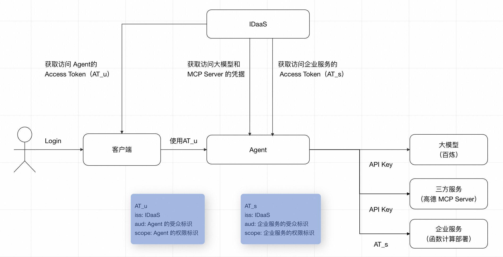
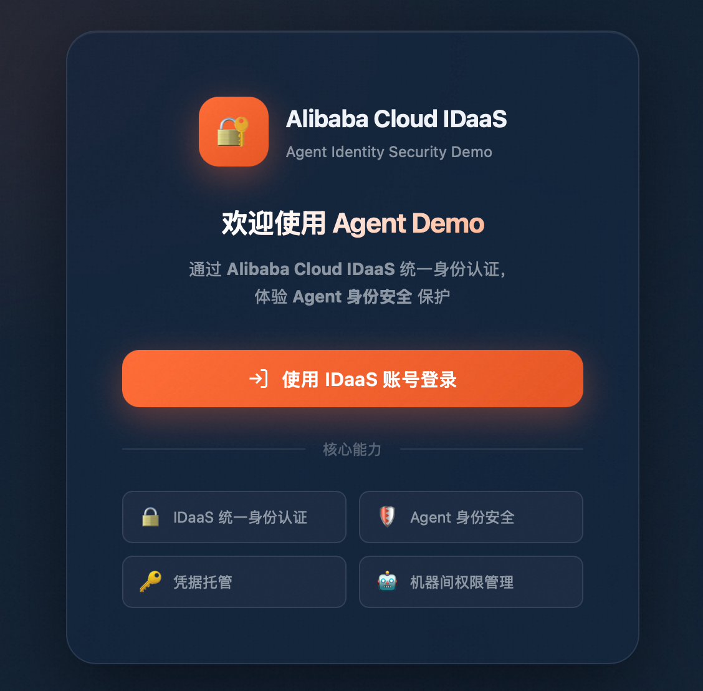
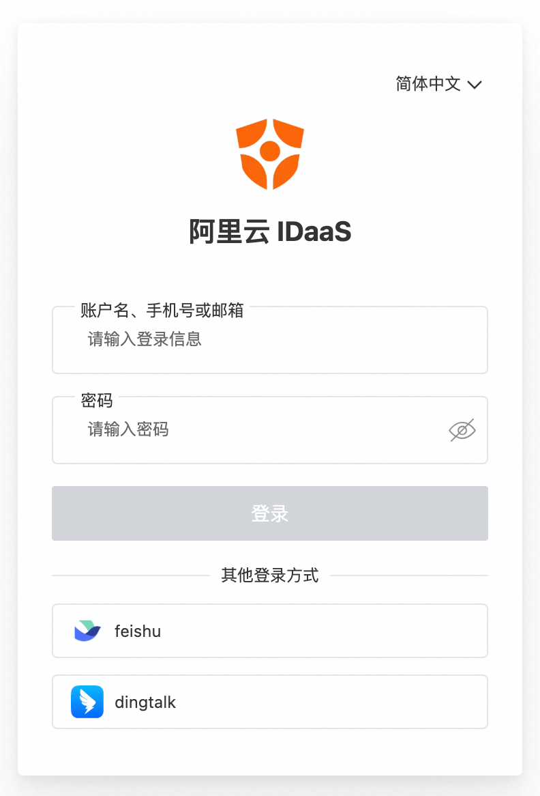
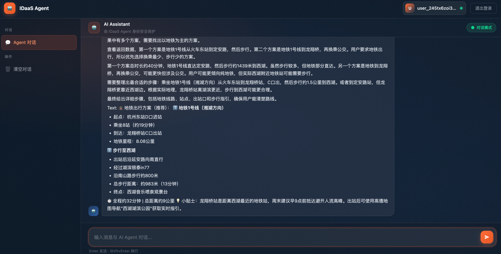
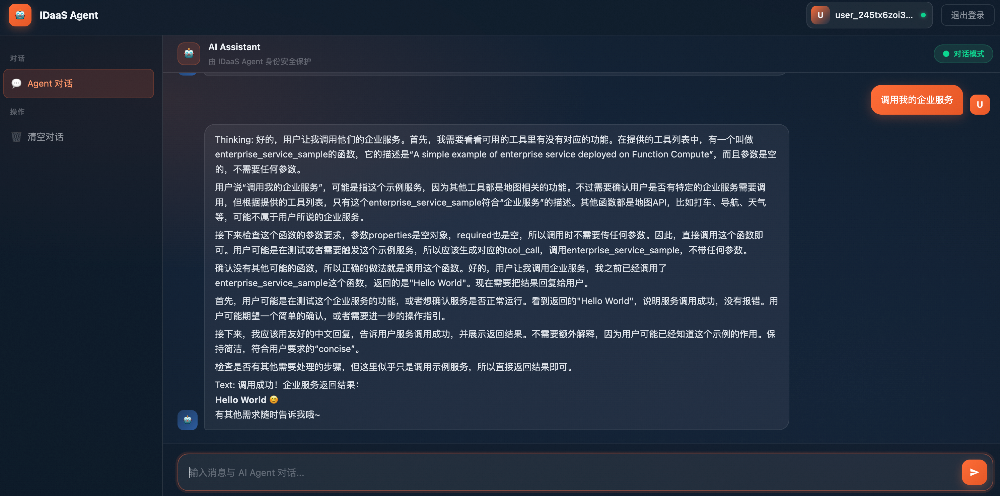

# Agent 身份安全 Sample

[English](README.md)

Agent 身份安全是阿里云 IDaaS 为 AI Agent 设计的身份与访问管理体系，用于安全管理 Agent 的数字身份，保护其访问凭证（API Key、OAuth Token 等），并支持 Agent 以自身身份或代表用户安全访问大模型、第三方服务及企业服务。     
本 Sample 基于**百炼大模型**、**高德 MCP Server** 及**函数计算**搭建，演示如何通过 IDaaS 实现以 Agent 为中心的入站与出站身份访问控制。

## 工作原理



### 入站访问

1. **用户认证**：用户通过客户端应用完成 SSO 登录，获取具备访问 Agent 服务权限的 Access Token（以下简称 **AT_u**）。AT_u 携带以下关键声明：

   - `iss`：IDaaS EIAM 实例的 Issuer
   - `aud`：Agent 的受众标识
   - `scope`：Agent 的权限标识

2. **调用 Agent**：客户端将 **AT_u** 作为 Bearer Token 携带在请求头中，连同用户的 AI 请求一并发送至 Agent 服务。

3. **权限校验**：Agent 服务对 **AT_u** 进行签名验证、受众标识及权限标识校验，校验通过后进入 Agent 初始化流程。

### Agent 初始化与出站访问

校验通过后，Agent 可以通过两种不同方式获取下游凭证并初始化：

#### 机器身份（Machine）

Agent 以自身 M2M 客户端应用身份从 IDaaS 获取所有下游凭证。

| 步骤 | 说明                                                                                                                                                                                    |
| --- |---------------------------------------------------------------------------------------------------------------------------------------------------------------------------------------|
| 获取大模型 API Key | Agent 通过 IDaaS 以 M2M 客户端应用身份获取托管的百炼 API Key，初始化 Agent 的 Model                                                                                                                         |
| 获取三方服务 API Key | Agent 通过 IDaaS 以 M2M 客户端应用身份获取托管的高德 MCP Server 的 API Key，构造 MCP Tool                                                                                                                  |
| 获取企业服务 Access Token | Agent 通过 IDaaS 以 M2M 客户端应用身份获取访问企业服务的 Access Token（**AT\_s**），构造企业服务 Tool，AT\_s 携带以下关键声明：<br> *   `iss`：IDaaS EIAM 实例的 Issuer<br>    *   `aud`：企业服务的受众标识<br>    *   `scope`：企业服务的权限标识 |
| Agent 初始化 | 上述步骤完成后，Agent 具备了调用大模型、三方服务和企业服务的完整能力。                                                                                                                                                |

此模式适用于 Agent 以自身身份独立操作的场景，下游服务感知到的是 Agent 的机器身份。

#### 用户身份（Human）

Agent 通过 Token Exchange 将用户的 AT_u 转换为下游服务凭证。


| 步骤 | 说明                                                                                                                                                                            |
| --- |-------------------------------------------------------------------------------------------------------------------------------------------------------------------------------|
| 获取大模型 API Key | Agent 使用 AT\_u 换取以用户身份访问 IDaaS 服务的凭证，获取托管的百炼 API Key，初始化 Agent 的 Model                                                                                                        |
| 获取三方服务 API Key | Agent 使用 AT\_u 换取以用户身份访问 IDaaS 服务的凭证，获取托管的高德 MCP Server 的 API Key，构造 MCP Tool                                                                                                 |
| 获取企业服务 Access Token | Agent 使用 AT\_u 换取以用户身份访问企业服务的 Access Token（**AT\_s**），构造企业服务 Tool，AT\_s 携带以下关键声明：<br> *   `iss`：IDaaS EIAM 实例的 Issuer<br>    *   `aud`：企业服务的受众标识<br>    *   `scope`：企业服务的权限标识 |
| Agent 初始化 | 上述步骤完成后，Agent 具备了调用大模型、三方服务和企业服务的完整能力。                                                                                                                                        |

此模式适用于需要感知用户身份的场景，用户身份贯穿 Agent 与下游服务的完整调用链。

### AI 请求处理

Agent 初始化完成后，接收用户 AI 请求，由 LLM 自主决策调用大模型、三方 MCP 服务或企业服务 Tool，最终将处理结果返回给用户。

## 准备工作

1. **准备运行环境**

   1. JDK 17+：[安装 JDK](https://www.oracle.com/java/technologies/javase-downloads.html)
   2. Maven：[安装 Maven](https://maven.apache.org/download.cgi)

2. **准备 IDaaS 能力**

   1. 登录 IDaaS 管理控制台，切换至目标地域。在左侧导航栏中，选择 **EIAM 云身份服务**。
   2. 单击**免费创建实例**，创建一个 IDaaS 实例。
   3. 单击**操作**列下的**升级**，售卖页中开启 M2M 管理。
   4. 单击**操作**列下的**访问控制台**，左侧菜单栏单击**账户 > 组织与账户 > 创建账户**，创建 IDaaS 账户。

3. **创建百炼 API Key**：参见[获取 API KEY](https://help.aliyun.com/zh/model-studio/get-api-key)，创建具有模型调用权限的 DashScope API Key。

4. **开通函数计算**：参见[开通函数计算服务](https://help.aliyun.com/zh/functioncompute/fc/web-function-quick-start)。

5. **完成 IDaaS Agent 入站/出站配置**，参见 [Agent 身份安全配置指导](https://help.aliyun.com/zh/idaas/eiam/user-guide/agent-id-configuration-guide)，配置要点如下：

   1. **大模型节点**：添加大模型的 API Key，本示例需要添加百炼 API Key
   2. **三方服务节点**：添加三方服务的 API Key，本示例需要添加高德 MCP Server API Key
   3. **企业服务节点**：添加企业服务 M2M 应用，配置受众标识和权限标识

## Agent 服务部署


### IDaaS SDK 接入配置

本 Sample 使用 IDaaS SDK，需要通过配置文件读取 IDaaS 的相关配置。

1. 进入 IDaaS 实例控制台，左侧菜单栏单击 **agent 身份安全**，选择 Agent。
2. 画布中单击 **Agent > 通用配置 > 认证管理**，可选择通过 Client Secret 或公私钥凭证生成 SDK 配置，点击生成 **SDK 配置**后复制内容。
3. 将复制的配置分别粘贴至以下两个文件：
   - `src/main/resources/cloud_idaas_config_for_computer.json`（本地部署使用）
   - `src/main/resources/cloud_idaas_config_for_agent_run.json`（AgentRun 部署使用）

详细的配置说明，可参见：[环境准备](https://help.aliyun.com/zh/idaas/eiam/developer-reference/environmental-preparation)。

### 函数计算部署企业服务

#### 创建函数

1. 登录函数计算控制台，在左侧导航栏中点击**函数管理 > 函数列表 > 创建函数**。
2. 点击**创建 web 函数**，运行环境选择**自定义运行时 > Java > Java 17**。
3. 代码上传方式选择**使用示例代码**，其他配置保持默认。
4. 点击**创建**，完成函数创建。

#### 设置 IDaaS JWT 认证

为函数的 HTTP 触发器配置 JWT 认证，确保只有持有 IDaaS 签发的 Access Token 才能访问企业服务：

1. 进入 IDaaS 实例控制台，左侧导航栏点击 **APP > M2M 应用管理**，选择出站配置中创建的企业服务应用。
2. **通用配置 > 应用配置信息**中复制验签公钥端点，在浏览器中打开并复制全部内容。
3. 进入函数计算控制台，在左侧导航栏中点击**函数管理 > 函数列表**，选择上一步创建的函数。
4. 函数详情中点击**函数拓扑图**中的**触发器**，认证方式选择 **JWT 认证**，将复制的内容粘贴到 **JWKS** 字段。
5. JWT Token 配置中**参数名称**设置为 **Authorization**，点击确定。

### 代码示例

**OpenAI 兼容接口**

```java
@PostMapping("/openai/v1/chat/completions")
public SseEmitter chatCompletions(@RequestHeader(value = "Authorization", required = true) String accessToken,
                                   @RequestBody ChatCompletionRequest request) throws Exception {

    // 去除 "Bearer " 前缀，提取 Access Token
    accessToken = accessToken.substring(7);

    // 校验用户访问 Agent 的 Access Token，包括签名校验、受众标识校验以及权限标识校验
    // 签名校验通过 IDaaS 实例的公钥端点进行校验，公钥端点需要通过环境变量指定
    String jwksEndpoint = System.getenv("JWKS_ENDPOINT");
    if (jwksEndpoint == null) {
        throw new ConfigException("JWKS_ENDPOINT should be specified via an environment variable.");
    }
    JwtValidator.validate(jwksEndpoint, accessToken);

    // 初始化 Agent
    // Agent 身份模式需要通过环境变量指定：Machine（机器身份）、Human（用户身份）
    ReActAgent agent;
    String accessIdentity = System.getenv("ACCESS_IDENTITY");
    if ("Machine".equals(accessIdentity)) {
        agent = AgentUtils.createAgentByMachineIdentity();
    } else if ("Human".equals(accessIdentity)) {
        agent = AgentUtils.createAgentByHumanIdentity(accessToken);
    } else {
        throw new ConfigException("ACCESS_IDENTITY should be either Machine or User.");
    }

    // 与 Agent 进行对话
    return ChatUtils.startChat(agent, request);
}
```

**AgentUtils - 机器身份模式（Machine）**：以 M2M 客户端身份从 IDaaS 获取所有凭证并初始化 Agent：

```java
public static ReActAgent createAgentByMachineIdentity() {

    // 读取 SDK 配置文件，完成 IDaaS 配置初始化
    // 使用 IDaaS SDK 获取托管在 IDaaS 中的凭证前，必须先完成此初始化
    IDaaSCredentialProviderFactory.init();

    // 创建 IDaaS SDK 客户端，以 M2M 客户端身份获取托管凭证
    IDaaSPamClient client = IDaaSPamClient.builder().build();

    // 示例：基于百炼平台创建 Agent Model
    // 此处获取托管的大模型 API Key，用于初始化 Agent 的 Model
    // API Key 标识需通过环境变量指定
    String llmApiKeyIdentifier = System.getenv("LLM_API_KEY_IDENTIFIER");
    if (llmApiKeyIdentifier == null){
        throw new ConfigException("LLM_API_KEY_IDENTIFIER should be specified via an environment variable.");
    }
    String llmApiKey = client.getApiKey(llmApiKeyIdentifier);

    // 初始化百炼 qwen-plus 模型
    DashScopeChatModel model = DashScopeChatModel.builder()
            .apiKey(llmApiKey)
            .modelName("qwen-plus")
            .stream(true)
            .enableThinking(true)
            .formatter(new DashScopeChatFormatter())
            .defaultOptions(GenerateOptions.builder()
                    .thinkingBudget(5000)
                    .build())
            .build();

    Toolkit toolkit = new Toolkit();

    // 示例：使用百炼平台上的高德 MCP Server 作为三方服务
    // 此处获取托管的三方服务 API Key，用于构造访问三方服务的 Tool
    // API Key 标识需通过环境变量指定
    String externalServerApiKeyIdentifier = System.getenv("EXTERNAL_SERVER_API_KEY_IDENTIFIER");
    if (externalServerApiKeyIdentifier == null){
        throw new ConfigException("EXTERNAL_SERVER_API_KEY_IDENTIFIER should be specified via an environment variable.");
    }
    String externalServerApiKey = client.getApiKey(externalServerApiKeyIdentifier);

    // 高德 MCP Server 的 SSE Endpoint 需通过环境变量指定
    String externalServerUrl = System.getenv("EXTERNAL_SERVER_URL");
    if (externalServerUrl == null){
        throw new ConfigException("EXTERNAL_SERVER_URL should be specified via an environment variable.");
    }
    // 构造访问高德 MCP Server 的 Tool
    McpClientWrapper externalServerClient = McpClientBuilder.create("Amap-Maps")
            .streamableHttpTransport(externalServerUrl)
            .header("Authorization", "Bearer " + externalServerApiKey)
            .timeout(Duration.ofSeconds(60))
            .buildAsync()
            .block();

    toolkit.registerMcpClient(externalServerClient).block();

    // 示例：基于函数计算部署企业服务
    // Agent 访问企业服务时需要携带 AccessToken，Scope 需通过环境变量指定
    // Scope 格式为 受众标识 + "|" + 权限标识，对应企业服务应用的受众标识和权限标识
    String enterpriseServiceScope = System.getenv("ENTERPRISE_SERVICE_SCOPE");
    if (enterpriseServiceScope == null){
        throw new ConfigException("ENTERPRISE_SERVICE_SCOPE should be specified via an environment variable.");
    }
    // 获取 IDaaS 凭证提供者，用于获取访问企业服务的凭证
    IDaaSCredentialProvider credentialProvider = IDaaSCredentialProviderFactory.getIDaaSCredentialProvider(enterpriseServiceScope);
    String AT_s = credentialProvider.getBearerToken();

    // 注册访问企业服务的自定义 Tool
    toolkit.registration()
            .tool(new EnterpriseServiceSampleTool())
            .presetParameters(Map.of("enterprise_service_sample", Map.of("AccessToken", AT_s)))
            .apply();

    // 使用配置好的百炼 Model、高德 MCP Server Tool 和企业服务 Tool 初始化 Agent
    return ReActAgent.builder()
            .name("Assistant")
            .sysPrompt("You are a helpful AI assistant. Be friendly and concise.")
            .model(model)
            .memory(new InMemoryMemory())
            .toolkit(toolkit)
            .build();
}
```

**AgentUtils - 用户身份模式（Human）**：通过 Token Exchange 将 AT_u 转换为用户身份凭证，以用户身份获取各类凭证并初始化 Agent：

```java
public static ReActAgent createAgentByHumanIdentity(String accessToken) {

    // 读取 SDK 配置文件，完成 IDaaS 配置初始化
    // 使用 IDaaS SDK 获取托管在 IDaaS 中的凭证前，必须先完成此初始化
    IDaaSCredentialProviderFactory.init();

    // 获取 IDaaS Token Exchange 凭证提供者，用于换取以用户身份访问 IDaaS 的凭证
    IDaaSTokenExchangeCredentialProvider defaultTokenExchangeProvider = IDaaSCredentialProviderFactory.getIDaaSTokenExchangeCredentialProvider();
    // 将 AT_u 换取以用户身份访问 IDaaS 的凭证
    IDaaSCredential credential = defaultTokenExchangeProvider.getCredential(accessToken, OAuth2Constants.ACCESS_TOKEN_TYPE, OAuth2Constants.ACCESS_TOKEN_TYPE);

    // 使用用户身份凭证构建静态凭证提供者
    IDaaSCredentialProvider staticCredentialProvider = StaticIDaaSCredentialProvider.builder()
            .setCredential(credential)
            .build();
    // 创建 IDaaS SDK 客户端，以用户身份获取托管凭证
    IDaaSPamClient client = IDaaSPamClient.builder()
            .credentialProvider(staticCredentialProvider)
            .build();

    // 示例：基于百炼平台创建 Agent Model
    // 此处获取托管的大模型 API Key，用于初始化 Agent 的 Model
    // API Key 标识需通过环境变量指定
    String llmApiKeyIdentifier = System.getenv("LLM_API_KEY_IDENTIFIER");
    if (llmApiKeyIdentifier == null){
        throw new ConfigException("LLM_API_KEY_IDENTIFIER should be specified via an environment variable.");
    }
    String llmApiKey = client.getApiKey(llmApiKeyIdentifier);

    // 初始化百炼 qwen-plus 模型
    DashScopeChatModel model = DashScopeChatModel.builder()
            .apiKey(llmApiKey)
            .modelName("qwen-plus")
            .stream(true)
            .enableThinking(true)
            .formatter(new DashScopeChatFormatter())
            .defaultOptions(GenerateOptions.builder()
                    .thinkingBudget(5000)
                    .build())
            .build();

    Toolkit toolkit = new Toolkit();

    // 示例：使用百炼平台上的高德 MCP Server 作为三方服务
    // 此处获取托管的三方服务 API Key，用于构造访问三方服务的 Tool
    // API Key 标识需通过环境变量指定
    String externalServerApiKeyIdentifier = System.getenv("EXTERNAL_SERVER_API_KEY_IDENTIFIER");
    if (externalServerApiKeyIdentifier == null){
        throw new ConfigException("EXTERNAL_SERVER_API_KEY_IDENTIFIER should be specified via an environment variable.");
    }
    String externalServerApiKey = client.getApiKey(externalServerApiKeyIdentifier);

    // 高德 MCP Server 的 SSE Endpoint 需通过环境变量指定
    String externalServerUrl = System.getenv("EXTERNAL_SERVER_URL");
    if (externalServerUrl == null){
        throw new ConfigException("EXTERNAL_SERVER_URL should be specified via an environment variable.");
    }
    // 构造访问高德 MCP Server 的 Tool
    McpClientWrapper externalServerClient = McpClientBuilder.create("Amap-Maps")
            .streamableHttpTransport(externalServerUrl)
            .header("Authorization", "Bearer " + externalServerApiKey)
            .timeout(Duration.ofSeconds(60))
            .buildAsync()
            .block();

    toolkit.registerMcpClient(externalServerClient).block();

    // 示例：基于函数计算部署企业服务
    // Agent 访问企业服务时需要携带 AccessToken，Scope 需通过环境变量指定
    // Scope 格式为 受众标识 + "|" + 权限标识，对应企业服务应用的受众标识和权限标识
    String enterpriseServiceScope = System.getenv("ENTERPRISE_SERVICE_SCOPE");
    if (enterpriseServiceScope == null){
        throw new ConfigException("ENTERPRISE_SERVICE_SCOPE should be specified via an environment variable.");
    }

    // 获取 IDaaS Token Exchange 凭证提供者，用于换取以用户身份访问企业服务的凭证
    IDaaSTokenExchangeCredentialProvider enterpriseServiceTokenExchangeProvider = IDaaSCredentialProviderFactory.getIDaaSTokenExchangeCredentialProvider(enterpriseServiceScope);
    // 将 AT_u 换取以用户身份访问企业服务的凭证
    String AT_s = enterpriseServiceTokenExchangeProvider.getIssuedToken(accessToken, OAuth2Constants.ACCESS_TOKEN_TYPE, OAuth2Constants.ACCESS_TOKEN_TYPE);

    // 注册访问企业服务的自定义 Tool
    toolkit.registration()
            .tool(new EnterpriseServiceSampleTool())
            .presetParameters(Map.of("enterprise_service_sample", Map.of("AccessToken", AT_s)))
            .apply();

    // 使用配置好的百炼 Model、高德 MCP Server Tool 和企业服务 Tool 初始化 Agent
    return ReActAgent.builder()
            .name("Assistant")
            .sysPrompt("You are a helpful AI assistant. Be friendly and concise.")
            .model(model)
            .memory(new InMemoryMemory())
            .toolkit(toolkit)
            .build();
}
```

**企业服务 Tool**：携带 AT_s 向部署在函数计算上的企业服务发起 HTTP 请求：

```java
@Tool(name = "enterprise_service_sample", description = "A simple example of enterprise service deployed on Function Compute")
public String enterpriseServiceSample(
        @ToolParam(name = "AccessToken", description = "Access Token for accessing the enterprise service.") String accessToken) {
    Map<String, List<String>> headers = new HashMap<>();
    headers.put("Authorization", Collections.singletonList("Bearer " + accessToken));
    // 函数计算的公网访问地址，需要通过环境变量指定
    String enterpriseServiceUrl = System.getenv("ENTERPRISE_SERVICE_URL");
    HttpRequest request = new HttpRequest.Builder()
            .httpMethod(HttpMethod.POST)
            .url(enterpriseServiceUrl)
            .headers(headers)
            .build();
    HttpResponse response = HttpClientFactory.getDefaultHttpClient().send(request);
    return response.getBody();
}
```

### 本地部署

#### 配置环境变量

```bash
export IDAAS_CLIENT_SECRET=xxx     # Client Secret 认证时配置
export ENV_PRIVATE_KEY=xxx         # 公私钥认证时配置
export JWKS_ENDPOINT=https://xxx.aliyunidaas.com/api/v2/iauths_system/oauth2/jwks
export AGENT_AUDIENCE=https://agentserver.example.com
export AGENT_SCOPE=agent.access
export ACCESS_IDENTITY=Machine     # Machine 或 Human
export LLM_API_KEY_IDENTIFIER=llm_api_key
export EXTERNAL_SERVER_API_KEY_IDENTIFIER=mcp_server_api_key
export ENTERPRISE_SERVICE_SCOPE="https://mcpserver.com|mcp.access"
export EXTERNAL_SERVER_URL=https://dashscope.aliyuncs.com/api/v1/mcps/amap-maps/mcp
export ENTERPRISE_SERVICE_URL=https://xxx.fcapp.run
```


| 环境变量名 | 说明 | 如何获取 |
| --- | --- | --- |
| IDAAS\_CLIENT\_SECRET | Agent 的 Client Secret（使用 Client Secret 认证时必填） | 1.  进入 IDaaS 实例页，左侧导航栏单击 **agent 身份安全**，选择 Agent 。<br>    2.  画布中单击 **Agent > 通用配置**，**认证管理**中复制 Client Secret 凭证。 |
| ENV\_PRIVATE\_KEY | Agent 的私钥（使用公私钥认证时必填，对应上传公钥的私钥） | 创建公私钥凭证时自行保管 |
| JWKS\_ENDPOINT | IDaaS 验签公钥端点，用于校验 AT\_u 签名 | 1.  进入 IDaaS 实例页面，左侧导航栏点击 **APP > M2M 应用管理**，选择客户端应用。<br>    2.  **通用配置 > 应用配置信息**中复制验签公钥端点。 |
| AGENT\_AUDIENCE | Agent 的受众标识，用于校验 AT\_u 的 `aud` 字段 | 1.  进入 IDaaS 实例页，左侧导航栏单击 **agent 身份安全**，选择 Agent 。<br>    2.  画布中单击 **Agent > 通用配置**，**受众标识**中复制。 |
| AGENT\_SCOPE | Agent 的权限标识，用于校验 AT\_u 的 `scope` 字段 | 1.  进入 IDaaS 实例页，左侧导航栏单击 **agent 身份安全**，选择 Agent 。<br>    2.  画布中单击 **Agent > 权限配置**，复制权限标识。 |
| ACCESS\_IDENTITY | Agent 身份模式：`Machine`（机器身份）或 `Human`（用户身份） | 根据业务需求配置 |
| LLM\_API\_KEY\_IDENTIFIER | 大模型节点的 API Key 标识。 | 1.  进入 IDaaS 实例页，左侧导航栏单击 **agent 身份安全**，选择 Agent 。<br>    2.  画布中单击 **大模型 > 基础信息** 中复制 API Key 标识。 |
| EXTERNAL\_SERVER\_API\_KEY\_IDENTIFIER | 三方服务节点的 API Key 标识。 | 1.  进入 IDaaS 实例页，左侧导航栏单击 **agent 身份安全**，选择 Agent 。<br>    2.  画布中单击 **三方服务 > 基础信息** 中复制 API Key 标识。 |
| ENTERPRISE\_SERVICE\_SCOPE | 企业服务的访问 Scope，格式为 `受众标识\|权限标识` | 1.  进入 IDaaS 实例页，左侧导航栏单击 **agent 身份安全**，选择 Agent 。<br>    2.  画布中单击 **企业服务 > 通用配置，认证管理** 中复制受众标识。<br>    3.  单击**权限配置**，复制权限标识。 |
| EXTERNAL\_SERVER\_URL | 访问三方服务的 Endpoint，示例为高德 MCP Server 的 SSE Endpoint。 | 1.  进入阿里云百炼控制台，顶部导航栏单击应用<br>    2.  左侧导航了选择 **MCP 广场**，搜索 **Amap Maps 高德地图**，详情页底部获取 |
| ENTERPRISE\_SERVICE\_URL | 访问企业服务的 Endpoint，示例为函数计算的公网访问地址。 | 1.  进入函数计算控制台，在左侧导航栏中点击**函数管理 > 函数列表**，选择之前创建的函数。<br>    2.  函数详情中点击**函数拓扑图**中的**触发器**，复制公网访问地址。 |

#### 运行 Sample 代码

1. 在 sample 目录下运行如下命令，打包项目为 JAR：

   ```bash
   mvn clean package
   ```

2. 运行 JAR，示例通过 Java 系统属性指定 IDaaS SDK 的配置文件，更多信息，可参见：[环境准备](https://help.aliyun.com/zh/idaas/eiam/developer-reference/environmental-preparation)。

   ```bash
   java -Dcloud_idaas_config_path=alibaba_cloud_idaas_config_for_computer.json -jar target/idaas-java-agent-id-demo-1.0.jar
   ```

### AgentRun 平台部署

#### 打包并压缩项目

1. 在 sample 目录下运行如下命令，打包项目为 JAR：

   ```bash
   mvn clean package
   ```

2. 在 sample 目录下运行如下命令，压缩项目为 ZIP：

   ```bash
   cd ../
   zip -r idaas-java-agent-id-demo.zip idaas-java-agent-id-demo/
   ```

#### 创建执行角色

通过 AgentRun 创建 Agent 需要配置执行角色，角色信任主体为函数计算云服务：

1. 进入 **RAM 访问控制**控制台，**身份管理 > 角色 > 创建角色**。
2. 信任主体类型选择**云服务**，信任主体名称选择**函数计算/FC**。
3. 角色名称设置为 `sample-fc-role`。

#### 创建 Agent

1. 登录函数计算控制台，在左侧导航栏中点击**智能体 AgentRun**，进入 AgentRun 控制台。
2. 角色授权检查中点击**一键授权**，按照提示授权角色（第一次创建时需要）。
3. 点击**创建 Agent**，选择**代码创建**，填写以下信息：

   | 配置项      | 值 |
   |----------| --- |
   | Agent 名称 | 自定义 |
   | 选择代码来源   | 上传代码包（选择 `idaas-java-agent-id-demo.zip`） |
   | 运行时      | Java 17 |
   | 启动命令     | 见下方 |
   | 启动端口     | 9002 |

   启动命令：

   ```bash
   java -Dcloud_idaas_config_path=classpath:alibaba_cloud_idaas_config_for_agent_run.json -jar idaas-java-agent-id-demo/target/idaas-java-agent-id-demo-1.0.jar
   ```

   示例通过 Java 系统属性指定 IDaaS SDK 的配置文件，更多信息，可参见：[环境准备](https://help.aliyun.com/zh/idaas/eiam/developer-reference/environmental-preparation)。

4. 环境变量配置：

| 环境变量名 | 说明 | 如何获取 | 示例 |
| --- | --- | --- |--|
| IDAAS\_CLIENT\_SECRET | Agent 的 Client Secret（使用 Client Secret 认证时必填） | 1.  进入 IDaaS 实例页，左侧导航栏单击 **agent 身份安全**，选择 Agent 。<br>    2.  画布中单击 **Agent > 通用配置**，**认证管理**中复制 Client Secret 凭证。 |  |
| ENV\_PRIVATE\_KEY | Agent 的私钥（使用公私钥认证时必填，对应上传公钥的私钥） | 创建公私钥凭证时自行保管 |  |
| JWKS\_ENDPOINT | IDaaS 验签公钥端点，用于校验 AT\_u 签名 | 1.  进入 IDaaS 实例页面，左侧导航栏点击 **APP > M2M 应用管理**，选择客户端应用。<br>    2.  **通用配置 > 应用配置信息**中复制验签公钥端点。 | `https://xxx.aliyunidaas.com/api/v2/iauths_system/oauth2/jwks` |
| AGENT\_AUDIENCE | Agent 的受众标识，用于校验 AT\_u 的 `aud` 字段 | 1.  进入 IDaaS 实例页，左侧导航栏单击 **agent 身份安全**，选择 Agent 。<br>    2.  画布中单击 **Agent > 通用配置**，**受众标识**中复制。 | `https://agentserver.example.com` |
| AGENT\_SCOPE | Agent 的权限标识，用于校验 AT\_u 的 `scope` 字段 | 1.  进入 IDaaS 实例页，左侧导航栏单击 **agent 身份安全**，选择 Agent 。<br>    2.  画布中单击 **Agent > 权限配置**，复制权限标识。 | `agent.access` |
| ACCESS\_IDENTITY | Agent 身份模式：`Machine`（机器身份）或 `Human`（用户身份） | 根据业务需求配置 | `Machine`, `Human` |
| LLM\_API\_KEY\_IDENTIFIER | 大模型节点的 API Key 标识。 | 1.  进入 IDaaS 实例页，左侧导航栏单击 **agent 身份安全**，选择 Agent 。<br>    2.  画布中单击 **大模型 > 基础信息** 中复制 API Key 标识。 | `llm_api_key` |
| EXTERNAL\_SERVER\_API\_KEY\_IDENTIFIER | 三方服务节点的 API Key 标识。 | 1.  进入 IDaaS 实例页，左侧导航栏单击 **agent 身份安全**，选择 Agent 。<br>    2.  画布中单击 **三方服务 > 基础信息** 中复制 API Key 标识。 | `mcp_server_api_key` |
| ENTERPRISE\_SERVICE\_SCOPE | 企业服务的访问 Scope，格式为 `受众标识\|权限标识` | 1.  进入 IDaaS 实例页，左侧导航栏单击 **agent 身份安全**，选择 Agent 。<br>    2.  画布中单击 **企业服务 > 通用配置，认证管理** 中复制受众标识。<br>    3.  单击**权限配置**，复制权限标识。 | `https://mcpserver.com\|mcp.access` |
| EXTERNAL\_SERVER\_URL | 访问三方服务的 Endpoint，示例为高德 MCP Server 的 SSE Endpoint。 | 1.  进入阿里云百炼控制台，顶部导航栏单击应用<br>    2.  左侧导航了选择 **MCP 广场**，搜索 **Amap Maps 高德地图**，详情页底部获取 | `https://dashscope.aliyuncs.com/api/v1/mcps/amap-maps/mcp` |
| ENTERPRISE\_SERVICE\_URL | 访问企业服务的 Endpoint，示例为函数计算的公网访问地址。 | 1.  进入函数计算控制台，在左侧导航栏中点击**函数管理 > 函数列表**，选择之前创建的函数。<br>    2.  函数详情中点击**函数拓扑图**中的**触发器**，复制公网访问地址。 | `https://xxx.fcapp.run` |

5. 执行角色配置，选择之前创建的 `sample-fc-role`，单击**开始部署**。
6. 部署完成后，Agent 卡片右下角点击详情，详情页中左侧导航栏点击**版本与灰度**，点击**创建 Endpoint**，获取公网访问地址。

## 客户端部署

### 前端 UI 配置

IDaaS Agent ID Demo 提供前端 UI，用户可以通过前端 UI 完成客户端应用的 SSO 登录，获取访问 Agent 服务的 Access Token，与 Agent 进行对话。

前端 UI 通过 `frontend/config.js` 进行配置：

```javascript
window.APP_CONFIG = {
    // Agent 服务地址
    API_URL: 'http://localhost:9002/openai/v1/chat/completions',
    // IDaaS 的授权端点
    IDAAS_AUTHORIZE_ENDPOINT: 'https://xxx.aliyunidaas.com/login/app/common/oauth2/authorize',
    // IDaaS 的登出端点
    IDAAS_LOGOUT_ENDPOINT: 'https://xxx.aliyunidaas.com/login/app/common/oauth2/logout',
    // 客户端应用 ID
    CLIENT_ID: 'app_xxx',
    // 请求的 Scope，格式为 受众标识|权限标识
    SCOPE: 'https://agentserver.example.com|agent.access'
};
```

| 字段名 | 说明 | 如何获取                                                                                                                                                                                                                   |
| --- | --- |------------------------------------------------------------------------------------------------------------------------------------------------------------------------------------------------------------------------|
| API\_URL | 后端 Agent 服务的请求路径 | 1.   本地部署路径：`http://localhost:9002/openai/v1/chat/completions`<br>    2.   AgentRun 部署：<br>    *   Agent 卡片右下角点击详情，详情页中左侧导航栏点击版本与灰度<br>    *   复制创建好的 Endpoint 的域名路径<br>    *   请求路径为域名路径拼接 `/openai/v1/chat/completions` |
| IDAAS\_AUTHORIZE\_ENDPOINT | IDaaS 的授权端点 | 1.  进入 IDaaS 实例页面，左侧导航栏点击 **APP > M2M 应用管理**，选择客户端应用。<br>2.  **通用配置 > 应用配置信息**中复制验签授权端点。                                                                                                                               |
| IDAAS_LOGOUT_ENDPOINT | IDaaS 的登出端点 | 1.  进入 IDaaS 实例页面，左侧导航栏点击 **APP > M2M 应用管理**，选择客户端应用。<br>2.  **通用配置 > 应用配置信息**中复制登出端点。                                                                                                                                              |
| CLIENT\_ID | 用户 SSO 登录的客户端应用 ID | 1.  进入 IDaaS 实例页，左侧导航栏单击 **agent 身份安全**，选择 Agent 。<br> 2.  画布中单击 **客户端 > 通用配置**，**认证管理**中复制 Client ID。                                                                                                                 |
| SCOPE | Agent 的访问 Scope，格式为 `受众标识\|权限标识` | 1.  进入 IDaaS 实例页，左侧导航栏单击 **agent 身份安全**，选择 Agent 。<br>    2.  画布中单击 **Agent > 通用配置，**复制受众标识。<br>   3.  单击**权限配置**，复制权限标识。                                                                                              |

### 客户端应用配置

前端 UI 使用 **OAuth 2.0 隐式模式**完成用户 SSO 登录，需在 IDaaS 配置对应的客户端应用：

1. 进入 IDaaS 实例控制台，左侧菜单栏单击**应用 > M2M 应用管理**，选择客户端应用，点击**登录访问**。
2. **授权模式**中开启**隐式模式**，隐式模式参数返回类型选择 **token**。
3. 在**登录 Redirect URI** 中填入前端 UI 地址（`http://127.0.0.1:9001`）。
4. 单击**显示高级配置**，登出回调地址填入前端 UI 地址（`http://127.0.0.1:9001`）。
5. 单击**确定**。

### 启动前端 UI

1. 安装 Node.js。更多信息，请参见[安装 Node.js](https://nodejs.org/zh-cn/download)。

2. 在 sample 目录下运行如下命令，启动前端 UI：

   ```bash
   cd frontend
   npx http-server -p 9001
   ```

## 运行演示

本地打开浏览器，访问 `http://127.0.0.1:9001`，跳转到前端 UI 登录界面。



点击**使用 IDaaS 账号登录**，跳转到 IDaaS 登录页，可通过 IDaaS 账户密码登录，或使用其他身份提供方登录（需要添加身份提供方并同步账户到 IDaaS）。



登录成功后，即可发送 AI 请求。请求携带 AT_u，Agent 服务完成校验后由 LLM 自主决策 Tool 调用并返回结果。

**示例一**：输入「现在出发，从杭州东站到杭州西湖风景名胜区，请提供地铁出行方案」，Agent 会自动调用高德地图 MCP Tool：



**示例二**：输入「调用我的企业服务」，Agent 会调用函数计算上的企业服务 Tool：



## 附录

### AgentRun 部署使用 OpenAPI 方式认证

在 AgentRun 场景下，IDaaS 支持 **OpenAPI 认证方式**：无需配置 Client Secret 或私钥，直接使用执行角色的 STS Token 访问 IDaaS OpenAPI，获取 Agent 的 Access Token。

#### 修改 IDaaS SDK 配置

修改 `src/main/resources/cloud_idaas_config_for_agent_run.json`，在原有配置基础上新增 `openApiEndpoint`，并修改 `authnConfiguration`，其余字段保持不变：

```json
{
    "idaasInstanceId": "idaas_xxx",
    "clientId": "app_xxx",
    "issuer": "https://xxx/api/v2/iauths_system/oauth2",
    "tokenEndpoint": "https://xxx/api/v2/iauths_system/oauth2/token",
    "scope": "api.example.com|read:file",
    "openApiEndpoint": "eiam.[region_id].aliyuncs.com",
    "developerApiEndpoint": "eiam-developerapi.[region_id].aliyuncs.com",
    "authnConfiguration": {
        "identityType": "CLIENT",
        "authnMethod": "PLUGIN",
        "pluginName": "alibabacloudPluginCredentialProvider"
    }
}
```

详细的配置说明，可参见：[环境准备](https://help.aliyun.com/zh/idaas/eiam/developer-reference/environmental-preparation)。

#### 执行角色配置

AgentRun 执行角色需具备调用 IDaaS `GenerateOauthToken` OpenAPI 的权限，示例权限策略如下：

```json
{
  "Version": "1",
  "Statement": [
    {
      "Effect": "Allow",
      "Action": "eiam:GenerateOauthToken",
      "Resource": [
        "acs:eiam:{#regionId}:{#accountId}:instance/{#InstanceId}/application/{#ApplicationId}"
      ]
    }
  ]
}
```

将 `{#regionId}`、`{#accountId}`、`{#InstanceId}`、`{#ApplicationId}` 替换为实际的地域 ID、阿里云主账号 ID、IDaaS 实例 ID 和 Agent 应用 ID。

创建权限策略与授权执行角色，可参见：[阿里云 OpenAPI 认证配置](https://help.aliyun.com/zh/idaas/eiam/developer-reference/alibaba-cloud-openapi-authentication)。

> AgentRun 部署服务时，需按上述说明修改 SDK 配置并配置执行角色，其余流程均保持一致。